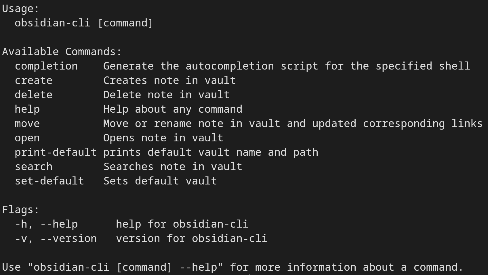

# Obsidian CLI

---


---
## [Installation and Usage Manual](https://yakitrak.github.io/obs/)

---

## Description

Obsidian is a powerful and extensible knowledge base application 
that works on top of your local folder of plain text notes. This CLI tool (written in Go) will let you interact with the application using the terminal. You are currently able to open, search, move, create, update and delete notes.

---

## Install

### Windows
You will need to have [Scoop](https://scoop.sh/) installed. On powershell run:
```
scoop bucket add scoop-yakitrak https://github.com/yakitrak/scoop-yakitrak.git
```

```
scoop install obs
```

For full installation instructions, see [Windows installation manual](https://yakitrak.github.io/obs/docs/install/windows).

### Mac and Linux

You will need to have [Homebrew](https://brew.sh/) installed.

```Bash
brew tap yakitrak/yakitrak
```

```Bash
brew install yakitrak/yakitrak/obs
```

For full installation instructions, see [Mac and Linux manual](https://yakitrak.github.io/obs/docs/install/mac-and-linux).

## Usage

### Help

```bash
# See All command instructions
obsd --help
```

### Set Default Vault

Defines default vault for future usage. If not set, pass `--vault` flag for other commands. You don't provide the path to vault here, just the name.

```bash
obsd set-default "{vault-name}"
```

Note: `open` and other commands in `obsd` use this vault's base directory as the working directory, not the current working directory of your terminal.

### Print Default Vault

Prints default vault and path. Please set this with `set-default` command if not set.

```bash
obsd print-default
```

### Open Note

Open given note name in Obsidian. Note can also be an absolute path from top level of vault.

```bash
# Opens note in obsidian
obsd open "{note-name}"

# Opens note in specified obsidian
obsd open "{note-name}" --vault "{vault-name}"

```

### Search Note

Opens obsidian search tab with given search text

```bash
# Searches in default obsidian
obsd search "{search-text}"

# Searches in specified obsidian
obsd search "{search-text}" --vault "{vault-name}"

```

### Create / Update Note

Creates note (can also be a path with name) in vault. By default, if the note exists, it will create another note but passing `--overwrite` or `--append` can be used to edit the named note.

```bash
# Creates empty note in default obsidian and opens it
obsd create "{note-name}"

# Creates empty note in given obsidian and opens it
obsd create "{note-name}"  --vault "{vault-name}"

# Creates note in default obsidian with content
obsd create "{note-name}" --content "abcde"

# Creates note in default obsidian with content - overwrite existing note
obsd create "{note-name}" --content "abcde" --overwrite

# Creates note in default obsidian with content - append existing note
obsd create "{note-name}" --content "abcde" --append

# Creates note and opens it
obsd create "{note-name}" --content "abcde" --open

```

### Move / Rename Note

Moves a given note(path from top level of vault) with new name given (top level of vault). If given same path but different name then its treated as a rename. All links inside vault are updated to match new name.

```bash
# Renames a note in default obsidian
obsd move "{current-note-path}" "{new-note-path}"

# Renames a note and given obsidian
obsd move "{current-note-path}" "{new-note-path}" --vault "{vault-name}"

# Renames a note in default obsidian and opens it
obsd move "{current-note-path}" "{new-note-path}" --open
```

### Delete Note

Deletes a given note (path from top level of vault).

```bash
# Renames a note in default obsidian
obsd delete "{note-path}" 

# Renames a note in given obsidian
obsd delete "{note-path}" --vault "{vault-name}"
```

## Contribution
Fork the project, add your feature or fix and submit a pull request. You can also open an [issue](https://github.com/yakitrak/obsidian-cli/issues/new/choose) to report a bug or request a feature.

## License
Available under [MIT License](./LICENSE)
